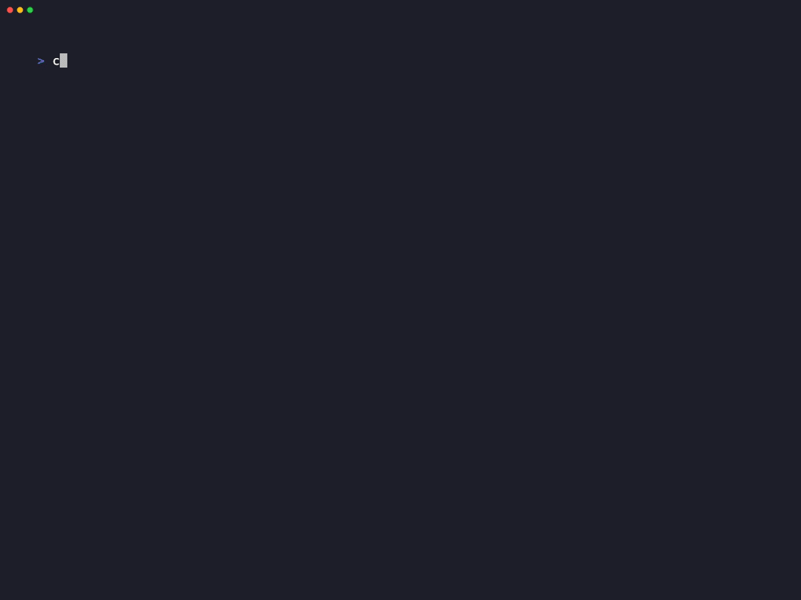

<p align="center">
  <h1 align="center">🧪 create-dsa-lab</h1>
  <p align="center">
    <strong>Stop grinding LeetCode in random files. Build a system.</strong>
  </p>
  <p align="center">
    Scaffold a zero-config, test-driven DSA laboratory in 30 seconds.<br/>
    Run, test, benchmark, and document every problem — from one terminal.
  </p>
</p>

<p align="center">
  <a href="https://www.npmjs.com/package/create-dsa-lab"></a>
  <a href="https://www.npmjs.com/package/create-dsa-lab"></a>
  <a href="LICENSE"></a>
  <a href="https://github.com/YTTHEMIGHTY/create-dsa-lab/actions"></a>
  
</p>

---

## ⚡ Quickstart — 30 Seconds

```bash
npx create-dsa-lab my-practice
cd my-practice
npm start
```

> 💡 A sample problem (**Container With Most Water**, LeetCode #11) is included — the dashboard works immediately. No setup required.

---

## 🎬 See It In Action

<p align="center">
  
</p>

**Edit your file → dashboard auto-re-runs.** No switching windows, no re-typing commands.

---

## 🤔 Why This Exists

You open LeetCode. You solve a problem. Where do you save it?

Most engineers end up with:
- 🗂️ Random files scattered across `Desktop/`, `tmp/`, `playground/`
- 📝 No tests — "I'll verify it on LeetCode's site"
- ⏱️ No benchmarks — "It passed, so it's probably fast enough"
- 🧠 No notes — "I'll remember the approach" *(you won't)*

**`create-dsa-lab` gives you a system:**

- ✅ **One folder per problem** — implementation, tests, and notes together
- ✅ **One command to do everything** — run, test, benchmark, read notes
- ✅ **Automatic file watching** — edit → instant feedback
- ✅ **Structured metadata** — difficulty, tags, Big O, all in your code
- ✅ **Beautiful notes server** — your markdown rendered with syntax highlighting + KaTeX

> *Built by an engineer preparing for top tech companies, for engineers doing the same.*

---

## ✨ Features

| | Feature | What it does |
|:--|:--|:--|
| 🎯 | **Interactive Dashboard** | Fuzzy-search problems → Run / Test / Benchmark / Notes — all from `npm start` |
| 🧪 | **TDD Built-In** | Every problem auto-generates a co-located `.test.ts` file |
| 📊 | **Benchmarker** | Warm-up + N iterations → avg/min/max time + memory delta + Big O annotations |
| 📚 | **Notes Server** | Markdown → beautiful dark-themed docs with syntax highlighting + KaTeX math |
| 🔥 | **Hot Reload** | Edit a file → dashboard re-runs your last action instantly |
| ⚙️ | **Fully Configurable** | Feature flags, custom categories, extensible `dsa-lab.config.json` |
| 📦 | **Sample Problem** | Includes Container With Most Water (LeetCode #11) — works out of the box |
| 🔄 | **Smart Update** | `update --dry-run` previews changes; only modified files are overwritten with `.bak` backups |
| 🗂️ | **Auto-Discovery** | Drop any folder in `src/` — it appears in the dashboard. No config needed |

---

## 🚀 Usage Guide

### Scaffold a Problem

```bash
npm run make lc twoSum_1         #  🏆 LeetCode
npm run make algo mergeSort      #  🔬 Algorithm
npm run make ds linkedList       #  📦 Data Structure
npm run make p slidingWindow     #  🧩 Pattern
npm run make b arrayProduct      #  🤑 Blind list     
npm run make pg myExperiment     #  🎮 Playground
```

Each problem gets three files:

```
src/leetcode/twoSum_1/
├── twoSum_1.ts           ← Implementation + metadata
├── twoSum_1.test.ts      ← Co-located test (TDD ready)
└── twoSum_1.md           ← Notes template
```

### The Benchmarker

Every problem exports a `meta` object with Big O annotations. The benchmarker measures real performance:

```
┌────────────────────────────────────────────────────┐
│            📊 Benchmark: Two Sum                    │
├──────────────┬─────────────────────────────────────┤
│ Difficulty   │ 🟢 Easy                              │
│ Tags         │ hash-map, array                      │
├──────────────┼─────────────────────────────────────┤
│ Time (Big O) │ O(n)                                 │
│ Space(Big O) │ O(n)                                 │
├──────────────┼─────────────────────────────────────┤
│ Avg Time     │ 0.0042ms                             │
│ Min Time     │ 0.0038ms                             │
│ Max Time     │ 0.0051ms                             │
│ Memory Delta │ +1.2 KB                              │
│ Iterations   │ 100                                  │
├──────────────┼─────────────────────────────────────┤
│ Output       │ [0, 1]                               │
│ Expected     │ [0, 1]              ✅ PASS           │
└──────────────┴─────────────────────────────────────┘
```

### The Notes Server

```bash
npm run notes
# → http://localhost:3030
```

Renders your `.md` notes with syntax highlighting, KaTeX math, and a searchable sidebar. Dark theme included.

### Configuration (`dsa-lab.config.json`)

```json
{
  "features": {
    "excalidraw": false,
    "notesServer": true,
    "benchmarker": true,
    "testing": true
  },
  "categories": [
    { "prefix": "lc", "folder": "leetcode", "label": "🏆 LeetCode" }
  ],
  "benchmark": { "iterations": 100 }
}
```

**Auto-discovery:** Add any folder to `src/` and it appears in the dashboard — no config change needed.

### Keeping Your Lab Updated

```bash
npx create-dsa-lab@latest update
```

Updates only changed files in `scripts/`. Unchanged files are skipped.

| Feature | Description |
|:--|:--|
| ✅ Smart diff | Only overwrites files that have actually changed |
| 📋 Backups | Creates `.bak` files before overwriting |
| 🔍 Dry run | Preview with `npx create-dsa-lab@latest update --dry-run` |

---

## 📁 What Gets Generated

```
my-practice/
├── src/
│   ├── algorithms/           ← Sorting, searching, etc.
│   ├── dataStructures/       ← Linked lists, trees, etc.
│   ├── leetcode/             ← LeetCode problems
│   │   └── containerWithMostWater_11/  ← Sample included!
│   ├── patterns/             ← Problem-solving patterns
│   ├── blind/                ← Curated interview list
│   └── playground/           ← Experiments
├── scripts/                  ← Dashboard, generator, notes server
├── dsa-lab.config.json       ← Feature flags & settings
├── jest.config.ts
├── tsconfig.json
└── package.json
```

---

## 🗺 Roadmap

We're building this in the open. Here's what's coming:

- [ ] `dsa-lab add` — install community problem packs
- [ ] Spaced repetition reminders for revisiting solved problems
- [ ] LeetCode problem auto-importer (fetch title, difficulty, tags)
- [ ] VS Code extension for inline benchmarking

Have an idea? [Open a discussion →](https://github.com/YTTHEMIGHTY/create-dsa-lab/discussions)

---

## 🤝 Contributing

We love contributions! Check the [Contributing Guide](CONTRIBUTING.md) for:
- Development setup
- How to add features
- Testing guidelines
- PR process

Quick links:
- 🐛 [Report a bug](https://github.com/YTTHEMIGHTY/create-dsa-lab/issues/new?template=bug_report.md)
- 💡 [Request a feature](https://github.com/YTTHEMIGHTY/create-dsa-lab/issues/new?template=feature_request.md)
- 📖 [Read the docs](docs/)

---

## 🌟 Who's Using This?

Built something with `create-dsa-lab`? Add yourself:

| Lab | Author | Focus |
| :--- | :--- | :--- |
| [daily-dsa](https://github.com/YTTHEMIGHTY/daily-dsa) | @YTTHEMIGHTY | Full DSA curriculum (90+ problems) |
| *Your lab here* | *You* | *Open a PR!* |

---

## 📄 License

[MIT](LICENSE) — use it, fork it, learn from it.
